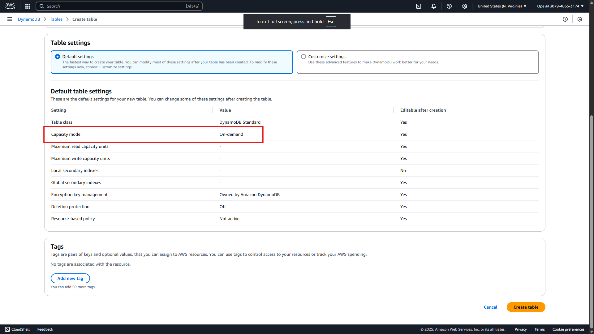
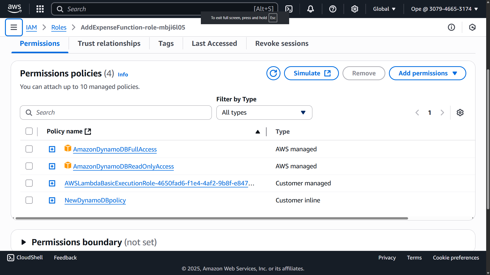
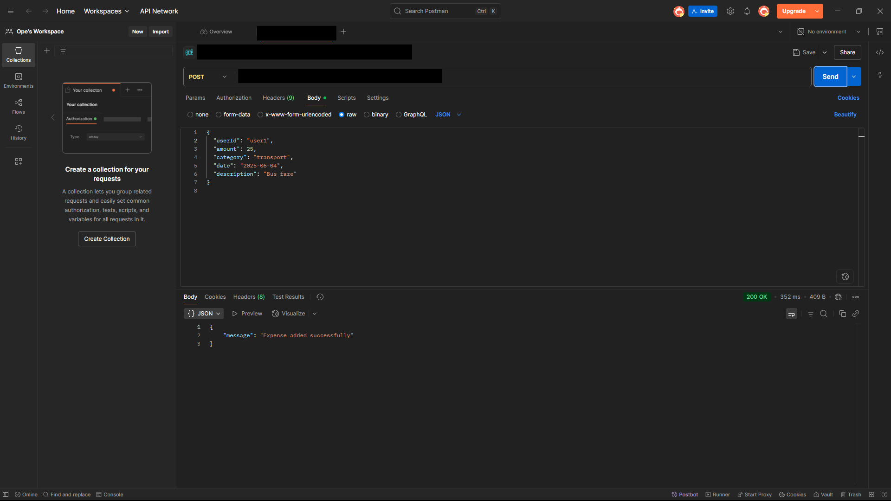
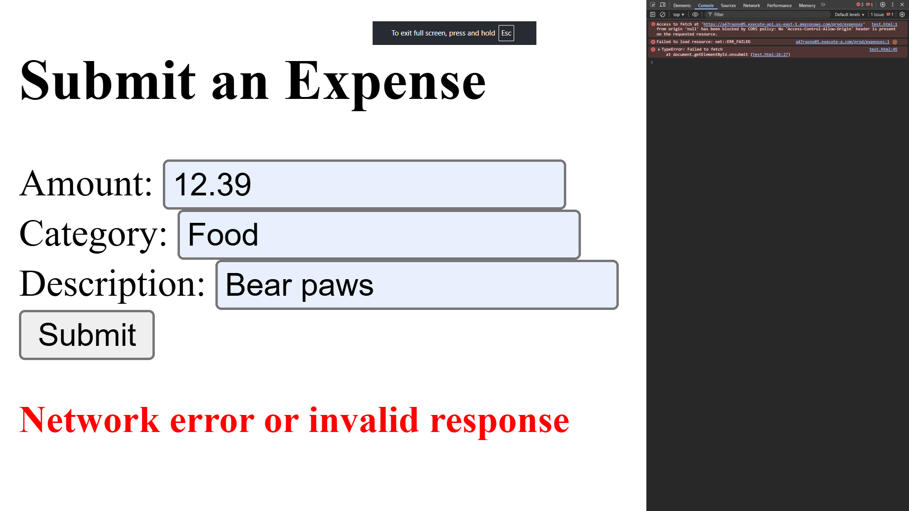
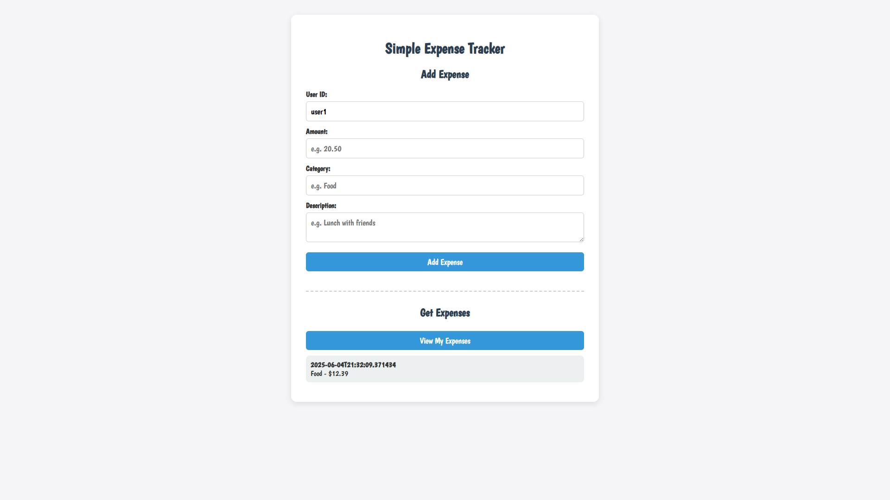

# 📗 Project Guide: Simple Expense Tracker

---

## 📝 Description

This guide walks you through building a **Simple Expense Tracker** using a fully serverless architecture on AWS. You’ll create:

- A **DynamoDB** table to store expenses.
- Two **Lambda functions** (`AddExpenseFunction` and `GetExpenseFunction`) written in Python.
- A **REST API** via **API Gateway** to expose these functions.
- A lightweight **HTML/JavaScript** frontend (`TestExpense.html`) for testing.

Along the way, you’ll see common pitfalls—such as data type mismatches, CORS misconfigurations, and integration errors—and learn how to troubleshoot them. Wherever a visual check is useful, you’ll find a placeholder to insert screenshots or console logs.

---

## 📑 Table of Contents

1. [Introduction](#introduction)  
2. [Service Selection & Motivation](#service-selection--motivation)  
   - Why These Services?  
   - Key Points & Justifications  
3. [Prerequisites](#prerequisites)  
4. [Step-by-Step Build Process](#step-by-step-build-process)  
   1. [Create the DynamoDB Table](#1-create-the-dynamodb-table)  
   2. [Develop & Deploy `AddExpenseFunction`](#2-develop--deploy-addexpensefunction)  
      - Initial Implementation  
      - Granting Permissions  
      - Testing & Debugging (Decimal vs. Float)  
   3. [Develop & Deploy `GetExpenseFunction`](#3-develop--deploy-getexpensefunction)  
      - Initial Implementation  
      - Adding Decimal Encoder  
      - CORS & Proxy Integration  
   4. [Create & Configure API Gateway](#4-create--configure-api-gateway)  
      - REST API vs. Alternatives  
      - Defining Resources & Methods  
      - Enabling CORS Headers  
      - Deploying to “prod” Stage  
   5. [Test with Postman & HTML Form](#5-test-with-postman--html-form)  
      - Postman Examples  
      - Basic HTML Form for POST  
      - Troubleshooting Missing Responses  
   6. [Enhance Frontend to View Expenses](#6-enhance-frontend-to-view-expenses)  
      - Styling with Boogaloo Font  
      - Adding GET Logic & Error Handling  
      - Verifying Lambda Proxy Integration  
5. [Common Mistakes & Checks](#common-mistakes--checks)  
6. [Image Placeholders](#image-placeholders)  
7. [Conclusion & Next Steps](#conclusion--next-steps)  

---

## 📖 Introduction

Building a serverless expense tracker lets you practice core AWS services—DynamoDB for storage, Lambda for compute, and API Gateway for HTTP endpoints—while also troubleshooting real-world integration challenges. The flow is:

1. **Store** expense items (userId, timestamp, amount, category, description) in DynamoDB.  
2. **Invoke** a Python-based Lambda function to write/read items.  
3. **Expose** those functions via API Gateway endpoints (`POST /expenses` and `GET /expenses`).  
4. **Test** with a simple HTML page (`TestExpense.html`) that calls the endpoints using JavaScript.  

By the end, you’ll have a functioning endpoint for adding expenses, retrieving them, and a local HTML page you can easily extend or host.

---

## ⚙️ Service Selection & Motivation

### Why These Services?

- **DynamoDB**  
  - ✅ *Fully managed NoSQL database*—eliminates server provisioning.  
  - ✅ *On-demand capacity* keeps you within AWS Free Tier.  
- **AWS Lambda**  
  - ✅ *Serverless compute*—only pay per execution.  
  - ✅ *Easy integration* with DynamoDB and API Gateway.  
- **API Gateway (REST API)**  
  - ✅ *Standard HTTP methods* (GET, POST) suit CRUD operations in expense tracking.  
  - ✅ *Built-in CORS support* to connect frontend and backend seamlessly.  
- **HTML + JavaScript Frontend**  
  - ✅ *Minimal dependencies*—quick to develop and test locally.  
  - ✅ Use of **Boogaloo** font from Google Fonts keeps the UI fun and readable.

### Key Points & Justifications

- **Keep Things Simple**  
  - On-demand DynamoDB settings (+ defaults) let you stay in the free tier.  
  - Python in Lambda leverages familiarity for faster debugging.  
- **API Choice: REST**  
  - RESTful endpoints map directly to our Lambda functions.  
  - Alternatives like GraphQL or gRPC add unnecessary complexity for basic CRUD.  
- **Local Test Page**  
  - `TestExpense.html` lets you iterate quickly before any deployment.  
  - No need to host on S3 until you want public access.  

---

## 📋 Prerequisites

Before you begin, ensure you have:

1. **An AWS Account** with permissions to create DynamoDB tables, Lambda functions, and API Gateway APIs.  
2. **AWS CLI** configured locally (optional, for exporting/importing API Gateway configs).  
3. **Python 3.x** installed locally (for syntax reference/testing).  
4. **Postman** or **curl** (for manual endpoint testing).  
5. **Text Editor** (e.g., VS Code) for editing code and HTML.  
6. Basic familiarity with JavaScript (ES6) and Python.

---

## 🛠 Step-by-Step Build Process

### 1. Create the DynamoDB Table

#### Steps:

1. Open the **DynamoDB Console** → Click **Create table**.  
2. Set **Table name**: `Expenses`  
3. **Partition key**: `userId` (String)  
4. **Sort key**: `timestamp` (String)  
5. Under **Capacity mode**, choose **On-demand** (to stay in Free Tier).  
6. Leave all other settings as default → Click **Create**.

> **Common Mistake #1**: Forgetting to set **On-demand** capacity can incur unexpected costs.  
> **Check**: Verify under **Capacity** in the DynamoDB Dashboard that “On-demand” is active.



---

### 2. Develop & Deploy `AddExpenseFunction`

#### 2.1 Initial Implementation

Create `backend/AddExpenseFunction.py` with:

```python
import json
import boto3
from datetime import datetime

dynamodb = boto3.resource('dynamodb')
table = dynamodb.Table('Expenses')

def lambda_handler(event, context):
    body = json.loads(event['body'])

    user_id    = body['userId']
    amount     = float(body['amount'])      # ❌ Float conversion can break DynamoDB item storage
    category   = body['category']
    description= body.get('description', '')
    timestamp  = datetime.utcnow().isoformat()

    item = {
        'userId':     user_id,
        'timestamp':  timestamp,
        'amount':     amount,
        'category':   category,
        'description':description
    }

    table.put_item(Item=item)

    return {
        'statusCode': 200,
        'body': json.dumps({'message': 'Expense added successfully'})
    }
````

> **Common Mistake #2**: Using `float(body['amount'])` directly. DynamoDB’s `Number` type expects a stringified decimal or a `decimal.Decimal` object. Converting to float can cause “ValidationException”.

#### 2.2 Granting Permissions

1. After deploying the function, navigate to **Configuration** → **Permissions** in the Lambda console.
2. Under **Execution Role**, click the role name to open the IAM console.
3. Click **Add permissions** → **Attach policies**.
4. Search for **AmazonDynamoDBFullAccess** → Select it → **Add permissions**.

> **Check**: In the IAM role’s **Permissions** tab, you should see **AmazonDynamoDBFullAccess** attached.



#### 2.3 Testing & Debugging (Decimal vs. Float)

1. Run a **Lambda Test** with this payload:

   ```json
   {
     "body": "{\"userId\":\"user1\",\"amount\":\"20.5\",\"category\":\"Groceries\",\"description\":\"Milk and eggs\"}"
   }
   ```
2. If you see an error like:

   ```
   ValidationException: One or more parameter values were invalid: Type mismatch for key amount expected: S, given: N
   ```

   it means the float conversion failed.
3. **Fix** by switching to `decimal.Decimal`:

```python
import json
import boto3
from datetime import datetime
from decimal import Decimal

dynamodb = boto3.resource('dynamodb')
table = dynamodb.Table('Expenses')

def lambda_handler(event, context):
    print("Received event:", event)

    try:
        body = json.loads(event['body'])
        user_id     = body['userId']
        amount      = Decimal(body['amount'])   # ✅ Use Decimal for DynamoDB compatibility
        category    = body['category']
        description = body.get('description', '')
        timestamp   = datetime.utcnow().isoformat()

        item = {
            'userId':     user_id,
            'timestamp':  timestamp,
            'amount':     amount,
            'category':   category,
            'description':description
        }

        table.put_item(Item=item)

        return {
            'statusCode': 200,
            'body': json.dumps({'message': 'Expense added successfully'})
        }
    except Exception as e:
        print("Error:", str(e))
        return {
            'statusCode': 500,
            'body': json.dumps({'error': str(e)})
        }
```

> **Check**: After saving, re-run the Lambda test. If successful, you’ll see:
>
> ```json
> { "message": "Expense added successfully" }
> ```

---

### 3. Develop & Deploy `GetExpenseFunction`

#### 3.1 Initial Implementation

Create `backend/GetExpenseFunction.py`:

```python
import json
import boto3
from boto3.dynamodb.conditions import Key

dynamodb = boto3.resource('dynamodb')
table = dynamodb.Table('Expenses')

def lambda_handler(event, context):
    print("Received event:", event)

    query_params = event.get('queryStringParameters')
    if not query_params or 'userId' not in query_params:
        return {
            'statusCode': 400,
            'body': json.dumps({'error': "Missing 'userId' in query parameters"})
        }

    user_id = query_params['userId']
    response = table.query(KeyConditionExpression=Key('userId').eq(user_id))
    expenses = response.get('Items', [])

    return {
        'statusCode': 200,
        'body': json.dumps({'expenses': expenses})
    }
```

> **Common Mistake #3**: Not encoding `Decimal` types when returning JSON—DynamoDB items contain `Decimal` objects, which `json.dumps` can’t serialize by default.

#### 3.2 Adding Decimal Encoder

Update to handle `Decimal`:

```python
import json
import boto3
from decimal import Decimal
from boto3.dynamodb.conditions import Key

class DecimalEncoder(json.JSONEncoder):
    def default(self, obj):
        if isinstance(obj, Decimal):
            return float(obj)
        return super().default(obj)

dynamodb = boto3.resource('dynamodb')
table = dynamodb.Table('Expenses')

def lambda_handler(event, context):
    print("🔍 Received event:", json.dumps(event))

    try:
        query_params = event.get('queryStringParameters')
        if not query_params or 'userId' not in query_params:
            raise ValueError("Missing 'userId' in query parameters")

        user_id = query_params['userId']
        response = table.query(KeyConditionExpression=Key('userId').eq(user_id))
        expenses = response.get('Items', [])

        return {
            'statusCode': 200,
            'headers': {
                'Content-Type': 'application/json',
                'Access-Control-Allow-Origin': '*'       # Allowed for CORS
            },
            'body': json.dumps({'expenses': expenses}, cls=DecimalEncoder)
        }
    except Exception as e:
        print("❌ Error:", str(e))
        return {
            'statusCode': 500,
            'headers': {
                'Content-Type': 'application/json',
                'Access-Control-Allow-Origin': '*'
            },
            'body': json.dumps({'error': str(e)})
        }
```

> **Check**: Test in Lambda with a payload such as:
>
> ```json
> { "queryStringParameters": { "userId": "user1" } }
> ```
>
> You should get back:
>
> ```json
> { "expenses": [ { "userId": "user1", "timestamp": "...", "amount": 20.5, ... } ] }
> ```

---

### 4. Create & Configure API Gateway

#### 4.1 REST API vs. Alternatives

* **Why REST?**

  * CRUD-friendly design (GET/POST).
  * Native support in API Gateway, no extra infrastructure.
  * Easy to test with Postman or browser.

#### 4.2 Defining Resources & Methods

1. Open **API Gateway Console** → **Create API** → **REST API (not private)**.
2. Name it: `ExpenseTrackerAPI`.
3. Under **Resources**, click **Actions** → **Create Resource**:

   * **Resource Name**: `expenses`
   * **Resource Path**: `/expenses`
4. With `/expenses` selected, click **Actions** → **Create Method** → **POST**.

   * Integration type: **Lambda Function** → Choose `AddExpenseFunction`.
   * Check **Use Lambda Proxy integration**.
5. Still under `/expenses`, click **Actions** → **Create Method** → **GET**.

   * Integration type: **Lambda Function** → Choose `GetExpenseFunction`.
   * Check **Use Lambda Proxy integration**.

> **Common Mistake #4**: Forgetting to enable **Lambda Proxy Integration**. Without it, query string parameters and event structures differ. Make sure **“Use Lambda Proxy Integration”** is checked for both methods.

#### 4.3 Enabling CORS Headers

1. Select the **POST** method under `/expenses` → click **Method Response**.
2. Add a response header named `Access-Control-Allow-Origin`.
3. Go back and select **Integration Response** → expand the `200` status code → click the **header mapping** → add:

   ```
   Access-Control-Allow-Origin : '*'  
   ```
4. Repeat steps 1–3 for the **GET** method.
5. Optionally, enable **OPTIONS** method on `/expenses` and configure the same CORS headers to handle preflight requests.

> **Check**: In **Method Execution** → **Test**, invoke both GET and POST. Observe that `Access-Control-Allow-Origin: *` appears in response headers.

#### 4.4 Deploying to “prod” Stage

1. In API Gateway, click **Actions** → **Deploy API**.
2. **Deployment stage**: Create a new stage named `prod`.
3. Note the **Invoke URL**, e.g.:

   ```
   https://<YOUR_API_ID>.execute-api.<region>.amazonaws.com/prod/expenses
   ```
   
---

### 5. Test with Postman & HTML Form

#### 5.1 Postman Examples

* **POST Request**

  ```
  POST https://<YOUR_API_ID>.execute-api.<region>.amazonaws.com/prod/expenses
  Headers:
    Content-Type: application/json

  Body (raw JSON):
  {
    "userId": "user1",
    "amount": "25",
    "category": "Transport",
    "description": "Bus fare"
  }
  ```

  * Expect:

    ```json
    { "message": "Expense added successfully" }
    ```
  * If you see a CORS error or missing headers, revisit your **Integration Response** → CORS header mappings in API Gateway.

* **GET Request**

  ```
  GET https://<YOUR_API_ID>.execute-api.<region>.amazonaws.com/prod/expenses?userId=user1
  ```

  * Expect:

    ```json
    {
      "expenses": [
        {
          "userId": "user1",
          "timestamp": "2025-06-04T12:34:56.789Z",
          "amount": 25.0,
          "category": "Transport",
          "description": "Bus fare"
        }
      ]
    }
    ```
  * If you receive `"expenses": null` or an error, ensure your Lambda returns `expenses` in the JSON body and that **Lambda Proxy** is enabled.

!

#### 5.2 Basic HTML Form for POST

Create a minimal `TestExpense.html` under `frontend/`:

```html
<!DOCTYPE html>
<html>
  <head>
    <title>Test Add Expense API</title>
  </head>
  <body>
    <h2>Submit an Expense</h2>
    <form id="expenseForm">
      <label>Amount: <input name="amount" required /></label><br />
      <label>Category: <input name="category" required /></label><br />
      <label>Description: <input name="description" /></label><br />
      <button type="submit">Submit</button>
    </form>

    <p id="response" style="margin-top: 1rem; font-weight: bold;"></p>

    <script>
      document.getElementById('expenseForm').onsubmit = async function (e) {
        e.preventDefault();
        const formData = new FormData(e.target);
        const data = Object.fromEntries(formData.entries());
        data.userId = "user1"; // Hardcoded user for now

        try {
          const res = await fetch(
            'https://<YOUR_API_ID>.execute-api.<region>.amazonaws.com/prod/expenses',
            {
              method: 'POST',
              headers: { 'Content-Type': 'application/json' },
              body: JSON.stringify(data),
            }
          );
          const result = await res.json();

          if (res.ok) {
            document.getElementById('response').innerText =
              result.message || 'Expense added!';
            document.getElementById('response').style.color = 'green';
            e.target.reset(); // Clear the form
          } else {
            document.getElementById('response').innerText =
              result.error || 'Something went wrong';
            document.getElementById('response').style.color = 'red';
          }
        } catch (err) {
          document.getElementById('response').innerText =
            'Network error or invalid response';
          document.getElementById('response').style.color = 'red';
          console.error(err);
        }
      };
    </script>
  </body>
</html>
```

> **Common Mistake #5**: Forgetting to add CORS headers in API Gateway → results in `Access to fetch at ... from origin ... has been blocked by CORS policy`.
> **Check**: Open browser DevTools → **Console** → Look for CORS errors. If present, revisit **API Gateway CORS settings**.



---

### 6. Enhance Frontend to View Expenses

#### 6.1 Styled HTML + JavaScript (`TestExpense.html`)

Replace the simple form with a more polished page that can **both** add and view expenses:

```html
<!DOCTYPE html>
<html lang="en">
<head>
  <meta charset="UTF-8" />
  <title>Expense Tracker</title>

  <!-- Google Font: Boogaloo -->
  <link
    href="https://fonts.googleapis.com/css2?family=Boogaloo&display=swap"
    rel="stylesheet"
  />

  <style>
    body {
      font-family: 'Boogaloo', cursive;
      background-color: #f4f4f9;
      margin: 0;
      padding: 2rem;
      color: #333;
    }

    h1,
    h2 {
      text-align: center;
      color: #2c3e50;
    }

    label {
      font-weight: bold;
      margin-top: 10px;
    }

    input,
    textarea,
    button {
      font-family: 'Boogaloo', cursive;
      width: 100%;
      padding: 10px;
      margin-top: 6px;
      margin-bottom: 12px;
      border-radius: 6px;
      border: 1px solid #ccc;
      box-sizing: border-box;
      font-size: 1.1rem;
    }

    button {
      background-color: #3498db;
      color: white;
      border: none;
      cursor: pointer;
      transition: background-color 0.3s ease;
    }

    button:hover {
      background-color: #2980b9;
    }

    .container {
      max-width: 600px;
      margin: 0 auto;
      background-color: #fff;
      padding: 2rem;
      border-radius: 12px;
      box-shadow: 0 4px 12px rgba(0, 0, 0, 0.1);
    }

    .expense {
      background: #ecf0f1;
      padding: 10px;
      margin-bottom: 10px;
      border-radius: 8px;
    }

    hr {
      margin: 30px 0;
      border: none;
      border-top: 2px dashed #ccc;
    }
  </style>
</head>
<body>
  <div class="container">
    <h1>Simple Expense Tracker</h1>

    <!-- Add Expense Section -->
    <h2>Add Expense</h2>
    <label>User ID:</label>
    <input type="text" id="userId" value="user1" />
    <label>Amount:</label>
    <input type="number" id="amount" placeholder="e.g. 20.50" />
    <label>Category:</label>
    <input type="text" id="category" placeholder="e.g. Food" />
    <label>Description:</label>
    <textarea id="description" placeholder="e.g. Lunch with friends"></textarea>
    <button onclick="addExpense()">Add Expense</button>
    <hr />

    <!-- View Expenses Section -->
    <h2>Get Expenses</h2>
    <button onclick="getExpenses()">View My Expenses</button>
    <div id="output"></div>
  </div>

  <script>
    const apiBaseUrl =
      'https://<YOUR_API_ID>.execute-api.<region>.amazonaws.com/prod/expenses';

    async function addExpense() {
      const userId = document.getElementById('userId').value.trim();
      const amount = document.getElementById('amount').value.trim();
      const category = document.getElementById('category').value.trim();
      const description = document
        .getElementById('description')
        .value.trim();

      const payload = { userId, amount, category, description };

      try {
        const raw = await fetch(apiBaseUrl, {
          method: 'POST',
          headers: { 'Content-Type': 'application/json' },
          body: JSON.stringify(payload),
        });

        const result = await raw.json();
        console.log('📦 POST API Response:', result);

        if (raw.ok) {
          alert('✅ Expense added successfully');
        } else {
          alert('❌ Error: ' + (result.error || 'Something went wrong'));
        }
      } catch (error) {
        console.error('❗ POST Error:', error);
        alert('❌ Network error');
      }
    }

    async function getExpenses() {
      const userId = document.getElementById('userId').value.trim();
      const output = document.getElementById('output');
      output.innerHTML = '🔄 Loading...';

      try {
        const raw = await fetch(
          `${apiBaseUrl}?userId=${encodeURIComponent(userId)}`,
          { method: 'GET' }
        );

        const data = await raw.json();
        console.log('📦 Full Response Body:', data);
        console.log('📊 Expenses Array:', data.expenses);

        if (!raw.ok) throw new Error(data.error || 'Failed to fetch expenses');

        const expenses = data.expenses || [];
        if (expenses.length > 0) {
          output.innerHTML = expenses
            .map(
              (exp) => `
            <div class="expense">
              <strong>${exp.timestamp}</strong><br>
              ${exp.category} - $${exp.amount}<br>
              <em>${exp.description}</em>
            </div>
          `
            )
            .join('');
        } else {
          output.innerHTML = '<p>📭 No expenses found.</p>';
        }
      } catch (error) {
        console.error('❗ GET Error:', error);
        output.innerHTML = `<p style="color:red;">Error: ${error.message}</p>`;
      }
    }
  </script>
</body>
</html>
```

> **Common Mistake #6**: Forgetting to enable **Lambda Proxy Integration** or mapping CORS headers for GET. This can result in `data.expenses` being `undefined`.
> **Check**: In API Gateway, ensure “Use Lambda Proxy integration” is checked for both methods and that the `Access-Control-Allow-Origin` header is returned.



---

## ⚠️ Common Mistakes & Checks

1. **Decimal vs. Float**

   * Mistake: Converting `amount` to `float` → DynamoDB rejects `Number` type.
   * Fix: Use `decimal.Decimal(body['amount'])` in Python.
   * Check: After deployment, run a Lambda test payload. Ensure no “ValidationException” related to data types.

2. **Missing IAM Permissions**

   * Mistake: Not attaching `AmazonDynamoDBFullAccess` (or a narrower policy) to Lambda’s role.
   * Fix: In IAM console, attach DynamoDB access policy.
   * Check: Under Lambda’s **Configuration → Permissions**, confirm DynamoDB policy is attached.

3. **Lambda Proxy Integration**

   * Mistake: Leaving “Use Lambda Proxy integration” unchecked → query parameters not passed properly.
   * Fix: Check the box when configuring the method’s integration.
   * Check: In **Method Execution → Integration Request**, ensure “Use Lambda Proxy integration” is enabled.

4. **CORS Configuration**

   * Mistake: Not returning `Access-Control-Allow-Origin` header → browser blocks requests.
   * Fix: In **Integration Response**, add header mappings:

     ```
     Access-Control-Allow-Origin : '*'
     Access-Control-Allow-Methods: 'GET,POST,OPTIONS'
     Access-Control-Allow-Headers: '*'
     ```
   * Check: In browser DevTools → **Network** tab, inspect your API response. Confirm CORS headers are present.

5. **Testing HTML Without Deployed Backend**

   * Mistake: Opening `TestExpense.html` locally before deploying Lambda & API → errors in console.
   * Fix: Deploy API first, update `apiBaseUrl` in HTML, then open the HTML file.
   * Check: In browser DevTools → **Console**, ensure no “Network error” or “CORS” warnings appear.

---


## 🏁 Conclusion & Next Steps

Congratulations—you now have a working serverless expense tracker! You’ve learned how to:

* Create and configure a DynamoDB table within the Free Tier.
* Write and debug Python Lambda functions, handling common data-type pitfalls.
* Expose Lambda functions via a REST API in API Gateway with proper CORS settings.
* Test endpoints using Postman and a lightweight HTML/JS frontend.

### Next Steps

* 🔒 **Add Authentication** (e.g., Cognito or API Keys) to secure your endpoints.
* 📈 **Visualize Expenses** with charts (perhaps using a React or Angular frontend).
* 🔁 **Implement Pagination/Filtering** in `GetExpenseFunction` for large datasets.
* 📦 **Package as a Serverless SAM or CDK Project** for Infrastructure-as-Code.

Feel free to expand and customize—this foundation is yours to build on!

```
```
