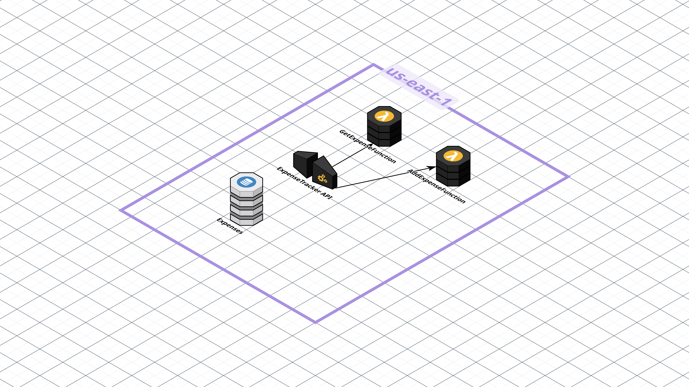

# 💰 Simple Expense Tracker

A fully serverless personal expense tracker built using AWS services. Users can log and retrieve expenses through a clean and secure API. This project demonstrates a foundational serverless architecture leveraging AWS Lambda, API Gateway, and DynamoDB. An included HTML file (`TestExpense.html`) allows you to test locally before deploying.

---

## 🛠 Tech Stack

- ☁️ **AWS Lambda**  
- 🌐 **Amazon API Gateway**  
- 📦 **Amazon DynamoDB**  
- 📝 **TestExpense.html** (Local UI)  
- 🖥️ **JavaScript** (frontend logic)  
- 🐍 **Python** (Lambda functions)  

*Tip: Each item above highlights the primary technology used. Feel free to swap or extend as your project grows!*  

---

## 🚀 Features

- ➕ **Add Expense** via `AddExpenseFunction` (POST)  
- 🔍 **Get Expenses** via `GetExpenseFunction` (GET)  
- 📂 **DynamoDB Data Store** using `userId` as the partition key  
- 💻 **Local Testing** with `TestExpense.html` (no deployment required)  
- 🔧 **Serverless Architecture** for scalability & cost-efficiency  

---

## 🏗️ Project Architecture
This project follows a serverless architecture using AWS managed services for scalability and cost-efficiency.


## 📂 Project Structure

```

simple-expense-tracker/
│
├── assets/
│   ├── architecture-diagram.png 🏗️ # Architecture diagram image
│   ├── browse-get-results.png 🖼️           # Screenshot showing GET results from browser
│   ├── cors-error-console.png 🖼️           # Browser console showing CORS error
│   ├── dynamodb-on-demand.png 🖼️           # DynamoDB capacity setting
│   ├── lambda-permissions.png 🖼️           # IAM role permissions for Lambda
│   ├── lambda-test-success.png 🖼️          # Successful test of Lambda writing to DynamoDB
│   └── postman-post-success.png 🖼️         # POST request success response in Postman
│
├── backend/
│   ├── AddExpenseFunction.py 🐍            # Lambda to add a new expense
│   └── GetExpenseFunction.py 🐍            # Lambda to retrieve expenses
│
├── frontend/
│   └── TestExpense.html 📝                 # Single HTML file for testing
│
└── infrastructure/
    └── ExpenseTracker_API-prod-oas30.yaml 🌐  # Exported API Gateway OpenAPI YAML

````

---

## ☁️ Infrastructure

- The `infrastructure/ExpenseTracker_API-prod-oas30.yaml` file contains the exported OpenAPI (YAML) configuration for your API Gateway setup.  
- You can import this file into another AWS account/region or use it to redeploy the same API configuration.  

---

## 🚀 How to Run & Deploy

### 🖥️ Local Testing

1. Open `frontend/TestExpense.html` in any modern browser.
2. The page includes form fields for **User ID**, **Amount**, **Category**, and **Description**.
3. Click **Add Expense** to invoke your local (or deployed) POST endpoint.
4. Click **View My Expenses** to fetch and display all stored items.

> **Note:** If you haven’t deployed the backend yet, the buttons will error out. You can still inspect the UI locally.

---

### 🛠️ Deploy Backend

1. **Create DynamoDB Table**

   * Table name: `Expenses`
   * Partition key: `userId` (String)
   * Sort key: `timestamp` (String)

2. **Deploy Lambda Functions**

   * Create `AddExpenseFunction` (runtime: Python 3.x) and upload `backend/AddExpenseFunction.py`.
   * Create `GetExpenseFunction` (runtime: Python 3.x) and upload `backend/GetExpenseFunction.py`.
   * Ensure each Lambda’s IAM role has permission to read/write your `Expenses` table.

3. **Configure API Gateway**

   * Create a new REST API in API Gateway.
   * **Resource**: `/expenses`

     * **POST** → Integration: **AddExpenseFunction**
     * **GET**  → Integration: **GetExpenseFunction**
   * Enable **CORS** on both methods (`POST` and `GET`) with `Access-Control-Allow-Origin: '*'`.
   * Deploy the API to a stage (e.g., `prod`) and note the **Invoke URL**.

4. **Update Frontend Endpoint**

   * In `TestExpense.html`, locate the line:

     ```js
     const apiBaseUrl = 'https://your-api-id.execute-api.your-region.amazonaws.com/prod/expenses';
     ```
   * Replace with your actual Invoke URL (including `/expenses`).

---

## 💡 Host Frontend

Since this is a single HTML file meant primarily for local testing, there’s no S3 or static site hosting required. Simply double-click or open `frontend/TestExpense.html` in a browser, and you’re ready to go!

If you decide later to host it publicly, you can upload `TestExpense.html` to any static host (e.g., S3, Netlify, GitHub Pages) and update `apiBaseUrl` accordingly.

---

## 📬 Contact

Ope – Aspiring Cloud Support Specialist
[LinkedIn](https://linkedin.com/in/oshinyemio) | [oshinyemio@gmail.com](mailto:oshinyemio@gmail.com)

---

## 📜 License

This project is licensed under the MIT License.

```
```
